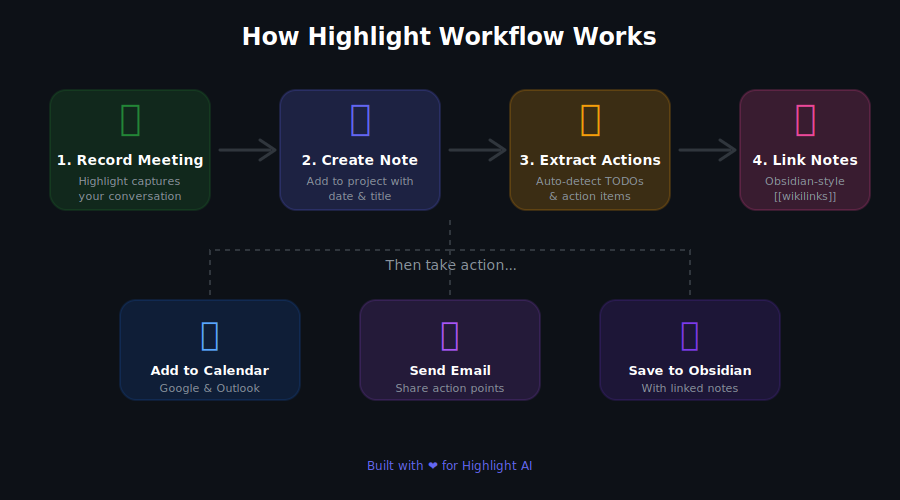
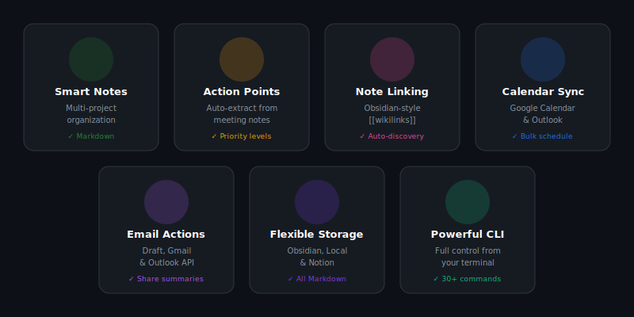

<div align="center">

# ✨ Highlight Workflow


### Your AI-powered meeting notes → action pipeline

[](https://choosealicense.com/licenses/mit/)
[](https://modelcontextprotocol.io/)
[](https://www.typescriptlang.org/)
[](https://nodejs.org/)

**Turn meeting transcripts into organized notes, actionable tasks, and calendar events — all with natural language in [Highlight AI](https://highlightai.com).**

[Getting Started](#-quick-start) •
[Features](#-features) •
[CLI Commands](#-cli-commands) •
[Highlight Setup](#-highlight-setup) •
[Obsidian Integration](#-obsidian-note-linking)

</div>

---

## 🎯 What is this?

Highlight Workflow is an MCP (Model Context Protocol) server that supercharges your Highlight AI experience. It connects your meeting notes to your favorite tools:

<div align="center">

</div>

---

## ⚡ Features

<div align="center">

</div>

| Feature | Description |
|---------|-------------|
| 📝 **Smart Notes** | Organize notes by project with automatic dating |
| ✅ **Action Extraction** | AI-powered detection of TODOs and action items |
| 🔗 **Note Linking** | Obsidian-style `[[wikilinks]]` with auto-discovery |
| 📅 **Calendar Sync** | Push action items to Google Calendar or Outlook |
| 📧 **Email Integration** | Share summaries via Gmail, Outlook, or draft |
| 🗃️ **Flexible Storage** | Obsidian vault, local files, or Notion |

---

## 🚀 Quick Start

### Installation

```bash
# Clone the repository
git clone https://github.com/marijnbaar/highlight-workflow.git
cd highlight-workflow

# Install dependencies
npm install

# Build the project
npm run build
```

### First Steps

```bash
# 1️⃣ Add your first project
./dist/cli.js project:add work --storage local

# 2️⃣ Create a note
./dist/cli.js note:add work "Sprint Planning" --extract

# 3️⃣ View action points
./dist/cli.js action:list

# 4️⃣ Find related notes
./dist/cli.js link:auto work <noteId>
```

---

## 💬 Highlight Setup

### Step 1: Add Custom Connection

1. Open **Highlight** → **Settings** (⌘ + ,)
2. Go to **Connections** → **Add Custom Command**
3. Configure:

| Field | Value |
|-------|-------|
| **Name** | `Highlight Workflow` |
| **Command** | `node` |
| **Argument** | `/path/to/highlight-workflow/dist/index.js` |

4. Enable **Start Automatically**
5. Click **Add**

### Step 2: Use Natural Language

Open Highlight (⌥ + Space) and try:

```
@Highlight Workflow add a note to my work project titled "Team Standup"
```

```
@Highlight Workflow find notes related to the sprint planning
```

```
@Highlight Workflow email the action points to team@company.com
```

---

## 📖 CLI Commands

### 📁 Projects

```bash
# Add a project
highlight-workflow project:add <name> --storage local|obsidian|notion

# List all projects
highlight-workflow project:list
```

### 📝 Notes

```bash
# Create a note (with auto action extraction)
highlight-workflow note:add <project> "Title" --extract --tags "meeting,q1"

# List notes
highlight-workflow note:list <project>
```

### ✅ Action Points

```bash
# List pending actions
highlight-workflow action:list --project work

# Add action to a note
highlight-workflow action:add <project> <noteId> "Follow up with client"
```

### 🔗 Note Linking

```bash
# Find related notes
highlight-workflow link:find <project> <noteId>

# Auto-link similar notes
highlight-workflow link:auto <project> <noteId>

# Add Obsidian wikilinks
highlight-workflow link:obsidian <project> <noteId>
```

### 📅 Calendar

```bash
# Add action to calendar (interactive)
highlight-workflow calendar:add --provider google

# Bulk schedule all actions
highlight-workflow schedule:all --project work
```

### 📧 Email

```bash
# Email action points
highlight-workflow email:actions team@company.com --project work

# Open draft in mail app
highlight-workflow email:draft --to boss@company.com
```

---

## 🔮 Obsidian Note Linking

One of the most powerful features is automatic note linking:

### How It Works

1. **Content Analysis** — Compares keywords, tags, and topics
2. **Relevance Scoring** — Calculates similarity percentage
3. **Auto-Discovery** — Finds related notes you didn't know were connected
4. **Wikilinks** — Adds `[[Note Title]]` links to your markdown

### Example Output

```markdown
## Related Notes

- 🔗 [[Sprint Planning 2024-01]] (67% match)
- 🔗 [[Client Requirements Doc]] (45% match)
- ⬅️ [[Previous Standup]] (backlink)
```

### Commands

```bash
# Find related notes (doesn't modify)
./dist/cli.js link:find work abc123

# Auto-link top matches
./dist/cli.js link:auto work abc123 --limit 5 --score 20

# Add wikilinks section to note
./dist/cli.js link:obsidian work abc123
```

---

## 🛠️ Configuration

Config is stored at `~/.highlight-workflow/config.json`

### Set Obsidian Vault

```bash
./dist/cli.js config:set obsidianVaultPath "/Users/you/Documents/Obsidian/Vault"
```

### Configure Google Calendar

```bash
./dist/cli.js config:google
# Follow prompts for OAuth credentials
```

### Configure Outlook

```bash
./dist/cli.js config:microsoft
# Follow prompts for Azure credentials
```

---

## 🤖 MCP Tools Reference

<details>
<summary><strong>📝 Note Tools (8)</strong></summary>

| Tool | Description |
|------|-------------|
| `add_note` | Create note with optional action extraction |
| `get_note` | Retrieve note by ID |
| `list_notes` | List all notes in project |
| `add_project` | Create new project |
| `list_projects` | List all projects |
| `add_action_point` | Add action to note |
| `list_action_points` | List pending actions |
| `extract_action_points` | Extract actions from text |

</details>

<details>
<summary><strong>🔗 Linking Tools (8)</strong></summary>

| Tool | Description |
|------|-------------|
| `find_related_notes` | Find similar notes |
| `link_notes` | Create bidirectional link |
| `unlink_notes` | Remove link |
| `get_linked_notes` | Get note's links |
| `auto_link_notes` | Auto-link similar notes |
| `find_backlinks` | Find notes linking here |
| `get_note_graph` | Get connection graph |
| `update_obsidian_links` | Add wikilinks to content |

</details>

<details>
<summary><strong>📅 Calendar Tools (4)</strong></summary>

| Tool | Description |
|------|-------------|
| `create_calendar_event` | Create event |
| `list_calendar_events` | List upcoming events |
| `add_action_to_calendar` | Schedule action point |
| `schedule_action_points` | Bulk schedule actions |

</details>

<details>
<summary><strong>📧 Email Tools (4)</strong></summary>

| Tool | Description |
|------|-------------|
| `compose_email` | Create and send/draft email |
| `email_action_points` | Email pending actions |
| `email_meeting_summary` | Send meeting summary |
| `open_email_draft` | Open in mail app |

</details>

---

## 📦 Publishing

Want to share this with others?

### MCP Registry

```bash
# Validate
npx @modelcontextprotocol/inspector

# Publish
./bin/mcp-publisher
```

### Cline Marketplace

Submit at [cline/mcp-marketplace](https://github.com/cline/mcp-marketplace)

---

## 🤝 Contributing

Contributions are welcome! Please feel free to submit a Pull Request.

---

## 📄 License

MIT © [marijnbaar](https://github.com/marijnbaar)

---

<div align="center">

**Built with ❤️ for the Highlight AI community**

[⬆ Back to top](#-highlight-workflow)

</div>
